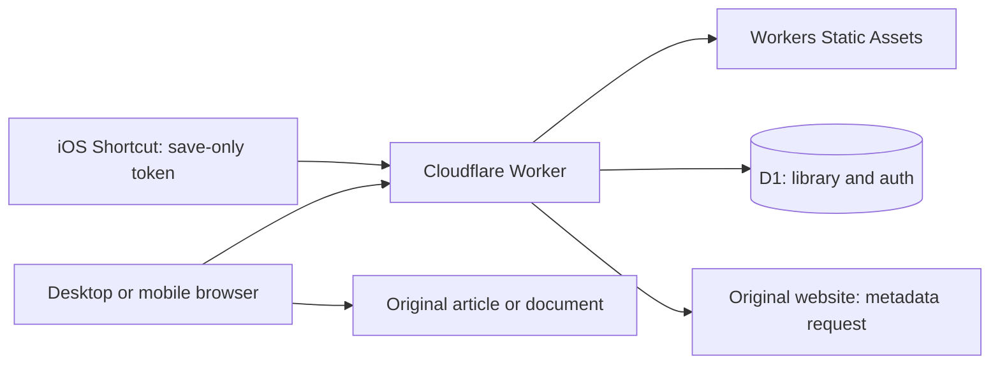

# Potem

**Potem** means “later” in Polish. It is a private, single-owner article inbox: send a URL from your desktop or phone, open the original document when ready, and explicitly mark it read. The website uses the lowercase **potem.** wordmark.

The current service stores links, article metadata, and read state. Preserving article bodies as Markdown is the next phase. The repository also retains the original Node.js Markdown-reader prototype.

## Product decisions

- **One owner, multiple devices.** GitHub login allows one configured numeric user ID. There is no public registration, collaboration, or separate library per account.
- **Reading starts at the original.** Opening a link never marks it read automatically. Mark read/unread is an explicit server-persisted action.
- **The reading list comes first.** The responsive website offers Unread, Read, and All views, search, pagination, an Add dialog, article details, title editing, and deletion. Light, dark, and system themes are available.
- **Capture should stay lightweight.** Use the website, a desktop bookmarklet, an iOS Shortcut, or an installed PWA share target where supported. Native apps, browser extensions, and email ingestion are deferred.
- **Keep the stack small.** One TypeScript Worker serves the API and website; one D1 database stores the library and authentication records. Use plain HTML/CSS/browser TypeScript, prepared SQL, and migrations, without a frontend framework or ORM.
- **Aim for free hosting.** Workers Static Assets and D1 are the selected Cloudflare services, with a `workers.dev` hostname avoiding a domain purchase. Free hosting depends on current account quotas and usage; no automatic upgrade to paid services is part of the design.
- **Backups must be portable.** Versioned JSON exports contain library data and can be restored without copying authentication records.

## Architecture



The website and API share an origin. Wrangler routes `/api`, `/api/*`, `/auth`, `/auth/*`, and `/healthz` through the Worker before static assets. The public app shell contains no private library data; authenticated API requests populate it. Unknown API/auth routes return JSON errors instead of the HTML shell.

HTTP handlers perform authentication and validation, then call the article repository. Normalization, metadata extraction, SQL access, and authentication have small dedicated modules. There is no generic storage-provider abstraction or separate backend server.

The frontend is bundled with esbuild. JavaScript and CSS use content-hashed filenames. A minimal service worker caches selected public assets only; it does not cache article data or support offline saves. Icon URLs are versioned. Local development runs the same Worker and migrations against Wrangler's local D1.

### Saving and article metadata

Both the authenticated Add form and token capture API use the same save path. URLs must be absolute HTTP(S), have no embedded credentials, and fit within 8 KiB. The submitted URL is retained for opening the original. A separate normalized URL is the unique deduplication key: normalize host/default ports, remove fragments and `utm_*`, `fbclid`, and `gclid`, and retain other query bytes/order, path case, and trailing slashes. This deliberately treats fragment-only differences as the same article; changing the policy later requires an explicit data migration.

Saving makes a best-effort metadata request to the source page. It reads at most 512 KiB of HTML with a 4.5-second timeout and extracts title, author, and description from common HTML/social metadata. A supplied title takes precedence; otherwise use extracted metadata, then a hostname/path fallback. Fetch failures, blocked pages, non-HTML documents, and missing metadata still permit saving the link. This request is not a preserved article copy, does not render JavaScript, and does not use the owner's browser cookies.

A unique SQL constraint handles concurrent duplicate saves. Duplicates keep their ID, saved date, and read state. A subsequent save can fill missing author/description or replace the generated fallback title; it preserves an edited title and reports whether metadata changed.

### Database and state

| Table | Purpose |
| --- | --- |
| `articles` | ID, submitted URL, unique normalized URL, title, optional author/description, created/updated timestamps, nullable read timestamp |
| `sessions` | Hashed session tokens, CSRF tokens, expiry and creation time |
| `oauth_states` | Short-lived hashed OAuth state and browser binding |
| `capture_tokens` | Hashed save-only tokens, labels, creation and revocation dates |
| `capture_rate_buckets` | Atomic per-token, per-minute capture request counts |

There is no users table because the database represents one owner's library. Normal saves generate UUIDs; imports retain opaque IDs. Timestamps use UTC ISO strings. `read_at = NULL` means unread. Marking read twice retains the first read timestamp; marking unread clears it. Concurrent read changes use the last committed write.

Lists use descending `(created_at, id)` keyset pagination, with UTF-8-safe opaque cursors and page sizes of 1–100. Title/URL search uses parameterized substring SQL with escaped wildcard characters. Full-text indexing is deferred until the personal library needs it. Filters reset cursors, and the client ignores stale list responses.

D1 provides durable SQLite-style storage without operating a database server. A JSON file would not provide safe concurrent writes in a Worker. GitHub commits, used by the prototype, would complicate frequent saves and read-state changes. A Node/SQLite deployment remains a possible future alternative, rather than a second supported service deployment.

### Authentication and privacy

GitHub OAuth requests identity access (`read:user`) and checks the immutable numeric `OWNER_GITHUB_ID`. A short-lived, one-time state record is bound to the initiating browser. Successful login creates a 30-day session whose token is stored hashed in D1 and sent in an HttpOnly, Secure, SameSite=Lax cookie. Logout revokes it. Expired authentication records are cleaned with bounded work.

Cookie-authenticated writes require an exact same-origin `Origin` and a session-bound CSRF token. Library/auth responses use `private, no-store`; the Worker applies a restrictive content security policy and other browser security headers. Displayed content uses text nodes and validated HTTP(S) links. There is no cross-origin API allowance.

Settings creates revocable capture tokens. The plaintext is shown once; D1 stores only its hash. Tokens can save through `POST /api/capture` and cannot list, export, edit, or delete articles. Capture rejects browser cookies/Origin headers and allows 60 requests per minute per token using atomic D1 counters. Ordinary JSON request bodies are limited to 16 KiB; titles to 500 characters.

An explicit local authentication bypass works only on the configured loopback origin. It must remain absent from deployed environments. Changing the owner ID requires revoking existing sessions and capture tokens because all records belong to the same library.

## Capture from desktop and mobile

| Method | Behavior |
| --- | --- |
| Website | Open Add, paste a URL and optional title, then save using the owner session |
| Desktop bookmarklet | Opens `/add` with the page URL/title; review and confirm in the website |
| iOS Shortcut | POSTs one URL and optional title to `/api/capture` with a save-only bearer token |
| Installed PWA | Supported browsers open `/add` from shared URL/title/text; review and confirm |

`GET /add` never writes data. Drafts survive the login redirect and reload in same-origin session storage until saved. Shared query parameters are removed from the address bar. Ambiguous shared text does not silently choose a link. A paste fallback is always available; PWA share-target support varies, and native iOS/Android sharing requires actual-device validation. See the [capture guide](docs/capture.md) and website Capture help.

## API and backups

All API payloads are JSON with camelCase fields. Errors use `{error: {code, message}}`, with distinct validation, authentication, authorization, missing-resource, size-limit, rate-limit, and retryable storage errors.

| Route | Purpose |
| --- | --- |
| `GET /api/session` | Authentication state and CSRF token for the signed-in client |
| `GET /auth/github`, `GET /auth/github/callback` | Start and complete owner login |
| `POST /auth/logout` | Revoke the current session |
| `GET /api/articles` | Filter/search/page with `status`, `q`, `limit`, `cursor` |
| `POST /api/articles`, `POST /api/capture` | Save `{url, title?}`; return article, duplicate and metadata-update flags |
| `GET /api/articles/:id` | Retrieve an article |
| `PATCH /api/articles/:id` | Change title and/or read state |
| `DELETE /api/articles/:id` | Delete an article |
| `GET /api/export`, `POST /api/import` | Download or restore versioned library JSON |
| `GET`, `POST /api/capture-tokens` | List token metadata or create a token |
| `DELETE /api/capture-tokens/:id` | Revoke a token |
| `GET /healthz` | Public liveness response; not a database readiness check |

Export format is `{version: 1, exportedAt, articles: [...]}`. It includes metadata and read state, excludes authentication records, and streams articles in bounded pages. Concurrent edits can affect different pages, so avoid editing during a backup when consistent results matter.

Import accepts up to 1 MiB and 1,000 articles. It validates the complete input and uses a transactional D1 batch. New records retain IDs/dates; existing normalized URLs are skipped; IDs already associated with different URLs are rejected. Older exports without author/description remain accepted. Import is a restore/merge operation, not an overwrite or rollback mechanism. Keep exports outside Cloudflare and test restores in a separate database.

## Future Markdown preservation

The next phase keeps the original-link workflow and adds an optional private copy for source outages. The preferred first step is owner-provided Markdown from paste/upload or tools such as Obsidian Web Clipper. Browser clipping can capture pages the owner is already logged into without sending browser cookies to the backend.

Store copy content and capture metadata in a separate `article_copies` table; keep read state in `articles`. The planned initial bound is 256 KiB per copy, with D1 as storage. Add sanitized in-site reading and Markdown download, disable raw HTML/unsafe protocols, and advance the backup format with backward-compatible imports. External image references do not make a complete offline replica. R2 is deferred until measured storage needs justify it.

Automatic full-article extraction is a separate feasibility gate. It needs tested DNS/egress and redirect protections, bounded fetch/output sizes, runtime/CPU measurements, and reliable retries. The current metadata fetch does not establish those guarantees. If automatic capture is selected, use leased durable D1 jobs, bounded scheduled processing, and capped retries; commit the URL independently of archive success. `waitUntil` alone is not a durable queue. Headless browsers, paywall bypass, PDF conversion, image mirroring, tags, recommendations, and collaboration are outside the current plan. See archive tasks A01–A05 in the [implementation tracker](docs/tasks.md).

## Local development

Requires Node 22.12+ and pnpm 12.4.1.

```sh
pnpm install --frozen-lockfile
cp .dev.vars.example .dev.vars
pnpm db:migrate:local
pnpm dev
```

Open http://localhost:8787. The example enables loopback-only authentication bypass. `.dev.vars`, local database files, and build artifacts are ignored. Scripts disable loading the prototype's `.env` into Wrangler. Restart `pnpm dev` after frontend edits to rebuild assets.

```sh
pnpm check
pnpm typecheck
pnpm test
pnpm build
pnpm exec playwright install chromium
pnpm test:browser
```

`check` checks the preserved prototype's JavaScript syntax; `typecheck` checks Worker and browser TypeScript. Tests run against local Worker/D1 bindings and apply real migrations. `build` bundles assets and dry-runs deployment. Browser smoke uses temporary D1 storage and an ephemeral port to exercise persisted read state, capture drafts, errors, and desktop/mobile layouts. Chromium must be installed, or supplied through `BROWSER_EXECUTABLE`.

## Deployment and operations

One Worker deployment contains API code and static assets. Configure the exact `APP_ORIGIN`, owner ID, D1 binding, and GitHub OAuth callback `<origin>/auth/github/callback` for each environment. OAuth client credentials belong in Wrangler secrets, not source or browser code. Local, staging, and production data are separate; staging configuration still has placeholders. The committed production configuration identifies the production origin/database; configuration alone is not evidence of a successful deployment.

GitHub Actions runs syntax checks, typechecks, Worker/D1 tests, a dry-run build, and browser smoke on pushes and PRs. A push to `main` additionally applies production migrations and deploys after verification passes. The `production` Actions environment needs `CLOUDFLARE_API_TOKEN` and `CLOUDFLARE_ACCOUNT_ID`; OAuth secrets are configured on the Worker separately. PR checks do not deploy production. See [CI](docs/ci.md) and [deployment instructions](docs/deployment.md).

Back up before destructive schema changes. Prefer additive migrations and roll back only to code compatible with the current database; deployment does not automatically reverse migrations. Monitor request errors, CPU, D1 storage, and row usage without logging private URLs, content, tokens, or OAuth codes. Free quota exhaustion must produce recoverable errors rather than silently enabling paid services. Confirm live OAuth, anonymous-access restrictions, device capture, and backup restoration on the deployed origin; local tests cannot replace those checks.

## Repository map and supporting documents

| Path | Purpose |
| --- | --- |
| `src/worker.ts` | Routing, static assets, and response security policies |
| `src/auth/` | GitHub OAuth, owner sessions, capture tokens and limiter |
| `src/articles/` | Request validation, URL normalization, metadata extraction and SQL repository |
| `src/contracts.ts` | Worker bindings and shared article/error types |
| `web/` | Responsive website, capture help, manifest, icons and service worker |
| `migrations/` | Ordered article/auth/metadata SQL migrations |
| `tests/` | Worker/D1 integration and regression tests |
| `scripts/` | Asset build and isolated browser smoke |
| `.github/workflows/` | Verification and production deployment |
| `wrangler.jsonc` | Worker, assets and environment bindings |
| `server.mjs`, `public/`, `Dockerfile` | Preserved Node.js Markdown-reader prototype |

Supporting documents: [original design](docs/design.md), [implementation tracker](docs/tasks.md), [capture](docs/capture.md), [CI](docs/ci.md), [deployment and operations](docs/deployment.md), and [prototype](docs/prototype.md). The original design/tracker record the initial implementation scope; this README reflects the current code, including metadata enrichment and production CI deployment.

### Preserved prototype

```sh
mkdir -p articles
# Add Markdown files, or set ARTICLES_DIR to an existing folder.
pnpm start
```

Open http://localhost:3055. The prototype also runs directly with `node server.mjs` without installing dependencies. Its filesystem/GitHub storage, Markdown reader, and Docker deployment remain independent of the Worker. No vault files are automatically migrated or modified. A future vault importer should be read-only, report missing source URLs, preserve source files, and reconcile counts before retiring the old workflow.
