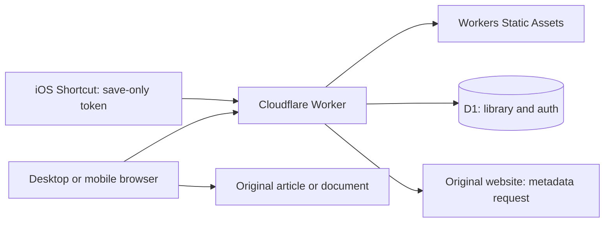

# Potem

**Potem** means “later” in Polish. It is a private, single-owner article inbox: send a URL from your desktop or phone, open the original document when ready, and explicitly mark it read. The website uses the lowercase **potem.** wordmark.

The current service stores links, article metadata, read state, and optional owner-provided Markdown copies. The repository also retains the original Node.js Markdown-reader prototype.

## Product decisions

- **One owner, multiple devices.** GitHub login allows one configured numeric user ID. There is no public registration, collaboration, or separate library per account.
- **Reading starts at the original.** Opening a link never marks it read automatically. Mark read/unread is an explicit server-persisted action.
- **The reading list comes first.** The responsive website offers Unread, Read, and All views, search, pagination, an Add dialog, article details, title editing, and deletion. Light, dark, and system themes are available.
- **Capture should stay lightweight.** Use the website, a desktop bookmarklet, an iOS Shortcut, or an installed PWA share target where supported. Native apps, browser extensions, and email ingestion are deferred.
- **Keep the stack small.** One TypeScript Worker serves the API and website; one D1 database stores the library and authentication records. Use plain HTML/CSS/browser TypeScript, prepared SQL, and migrations, without a frontend framework or ORM.
- **Aim for free hosting.** Workers Static Assets and D1 are the selected Cloudflare services, with a `workers.dev` hostname avoiding a domain purchase. Free hosting depends on current account quotas and usage; no automatic upgrade to paid services is part of the design.
- **Backups must be portable.** Versioned JSON exports contain library data and can be restored without copying authentication records.

## Architecture



The website and API share an origin. Wrangler routes `/api`, `/api/*`, `/auth`, `/auth/*`, and `/healthz` through the Worker before static assets. The public app shell contains no private library data; authenticated API requests populate it. Unknown API/auth routes return JSON errors instead of the HTML shell.

HTTP handlers perform authentication and validation, then call the article repository. Normalization, metadata extraction, SQL access, and authentication have small dedicated modules. There is no generic storage-provider abstraction or separate backend server.

The frontend is bundled with esbuild. JavaScript and CSS use content-hashed filenames. A minimal service worker caches selected public assets only; it does not cache article data or support offline saves. Icon URLs are versioned. Local development runs the same Worker and migrations against Wrangler's local D1.

### Saving and article metadata

Both the authenticated Add form and token capture API use the same save path. URLs must be absolute HTTP(S), have no embedded credentials, and fit within 8 KiB. The submitted URL is retained for opening the original. A separate normalized URL is the unique deduplication key: normalize host/default ports, remove fragments and `utm_*`, `fbclid`, and `gclid`, and retain other query bytes/order, path case, and trailing slashes. This deliberately treats fragment-only differences as the same article; changing the policy later requires an explicit data migration.

Saving makes a best-effort metadata request to the source page. It reads at most 512 KiB of HTML with a 4.5-second timeout and extracts title, author, and description from common HTML/social metadata. A supplied title takes precedence; otherwise use extracted metadata, then a hostname/path fallback. Fetch failures, blocked pages, non-HTML documents, and missing metadata still permit saving the link. This request is not a preserved article copy, does not render JavaScript, and does not use the owner's browser cookies.

A unique SQL constraint handles concurrent duplicate saves. Duplicates keep their ID, saved date, and read state. A subsequent save can fill missing author/description or replace the generated fallback title; it preserves an edited title and reports whether metadata changed.

### Database and state

| Table | Purpose |
| --- | --- |
| `articles` | ID, submitted URL, unique normalized URL, title, optional author/description, created/updated timestamps, nullable read timestamp |
| `sessions` | Hashed session tokens, CSRF tokens, expiry and creation time |
| `oauth_states` | Short-lived hashed OAuth state and browser binding |
| `capture_tokens` | Hashed save-only tokens, labels, creation and revocation dates |
| `capture_rate_buckets` | Atomic per-token, per-minute capture request counts |

There is no users table because the database represents one owner's library. Normal saves generate UUIDs; imports retain opaque IDs. Timestamps use UTC ISO strings. `read_at = NULL` means unread. Marking read twice retains the first read timestamp; marking unread clears it. Concurrent read changes use the last committed write.

Lists use descending `(created_at, id)` keyset pagination, with UTF-8-safe opaque cursors and page sizes of 1–100. Title/URL search uses parameterized substring SQL with escaped wildcard characters. Full-text indexing is deferred until the personal library needs it. Filters reset cursors, and the client ignores stale list responses.

D1 provides durable SQLite-style storage without operating a database server. A JSON file would not provide safe concurrent writes in a Worker. GitHub commits, used by the prototype, would complicate frequent saves and read-state changes. A Node/SQLite deployment remains a possible future alternative, rather than a second supported service deployment.

### Authentication and privacy

GitHub OAuth requests identity access (`read:user`) and checks the immutable numeric `OWNER_GITHUB_ID`. A short-lived, one-time state record is bound to the initiating browser. Successful login creates a 30-day session whose token is stored hashed in D1 and sent in an HttpOnly, Secure, SameSite=Lax cookie. Logout revokes it. Expired authentication records are cleaned with bounded work.

Cookie-authenticated writes require an exact same-origin `Origin` and a session-bound CSRF token. Library/auth responses use `private, no-store`; the Worker applies a restrictive content security policy and other browser security headers. Displayed content uses text nodes and validated HTTP(S) links. There is no cross-origin API allowance.

Settings creates revocable capture tokens. The plaintext is shown once; D1 stores only its hash. Tokens can save through `POST /api/capture` and cannot list, export, edit, or delete articles. Capture rejects browser cookies/Origin headers and allows 60 requests per minute per token using atomic D1 counters. Ordinary JSON request bodies are limited to 16 KiB; titles to 500 characters.

An explicit local authentication bypass works only on the configured loopback origin. It must remain absent from deployed environments. Changing the owner ID requires revoking existing sessions and capture tokens because all records belong to the same library.

## Capture from desktop and mobile

| Method | Behavior |
| --- | --- |
| Website | Open Add, paste a URL and optional title, then save using the owner session |
| Desktop bookmarklet | Opens `/add` with the page URL/title; review and confirm in the website |
| iOS Shortcut | POSTs one URL and optional title to `/api/capture` with a save-only bearer token |
| Installed PWA | Supported browsers open `/add` from shared URL/title/text; review and confirm |

`GET /add` never writes data. Drafts survive the login redirect and reload in same-origin session storage until saved. Shared query parameters are removed from the address bar. Ambiguous shared text does not silently choose a link. A paste fallback is always available; PWA share-target support varies, and native iOS/Android sharing requires actual-device validation. See the [capture guide](docs/capture.md) and website Capture help.

## API and backups

All API payloads are JSON with camelCase fields. Errors use `{error: {code, message}}`, with distinct validation, authentication, authorization, missing-resource, size-limit, rate-limit, and retryable storage errors.

| Route | Purpose |
| --- | --- |
| `GET /api/session` | Authentication state and CSRF token for the signed-in client |
| `GET /auth/github`, `GET /auth/github/callback` | Start and complete owner login |
| `POST /auth/logout` | Revoke the current session |
| `GET /api/articles` | Filter/search/page with `status`, `q`, `limit`, `cursor` |
| `POST /api/articles`, `POST /api/capture` | Save `{url, title?}`; return article, duplicate and metadata-update flags |
| `GET /api/articles/:id` | Retrieve an article |
| `PATCH /api/articles/:id` | Change title and/or read state |
| `DELETE /api/articles/:id` | Delete an article |
| `GET /api/articles/:id/copy`, `PUT /api/articles/:id/copy` | Read or save a private Markdown copy with revision checks |
| `GET /api/articles/:id/github`, `POST /api/articles/:id/github` | Check the configured GitHub destination or save the persisted Markdown copy there |
| `GET /api/export`, `POST /api/import` | Download or restore versioned library JSON |
| `GET`, `POST /api/capture-tokens` | List token metadata or create a token |
| `DELETE /api/capture-tokens/:id` | Revoke a token |
| `GET /healthz` | Public liveness response; not a database readiness check |

Export format is `{version: 2, exportedAt, articles: [...]}`; each article may include its Markdown copy and capture metadata. Import accepts versions 1 and 2. Exports exclude authentication records and stream articles in bounded pages. Concurrent edits can affect different pages, so avoid editing during a backup when consistent results matter.

Import accepts up to 1 MiB and 1,000 articles. It validates the complete input and uses a transactional D1 batch. New records retain IDs/dates and copies; existing normalized URLs are skipped without attaching their incoming copies; IDs already associated with different URLs are rejected. Older exports without author/description remain accepted. A full export can exceed the import bound, as before; split large restores into valid files. Import is a restore/merge operation, not an overwrite or rollback mechanism. Keep exports outside Cloudflare and test restores in a separate database.

To rehearse a downloaded backup without changing the file or contacting production, run `pnpm archive:rehearse --backup /absolute/path/export.json --report /absolute/path/report.json`. The count/byte report includes local database size, never private article content or production headroom. See the [archive rehearsal guide](docs/archive-rehearsal.md) for limits, cleanup, and the pending deployed release checks.

To convert an Obsidian/prototype Markdown folder offline, run `pnpm obsidian:convert --source /absolute/path/Articles --output /absolute/path/new-output-directory`. The converter reads but never changes the source, does not start the prototype or contact a service, and writes a private review report plus bounded version-2 import files. Review `report.json` before using Settings → Import. See the [Obsidian migration guide](docs/obsidian-import.md) for mapping rules, limits, and fixture evidence; actual-vault migration remains an owner-reviewed step.

## Markdown preservation

Article details let the owner paste Markdown or load a UTF-8 `.md`/`.markdown` file. Saving is explicit, replacements use revision checks, and each copy is limited to 256 KiB UTF-8. The editor shows capture time, source, and byte count; failed saves keep the draft. The original link and read state remain independent.

Check **Also save to GitHub** to additionally commit the saved Markdown with source/capture frontmatter. Production targets `Pajdzik/Kamilpedia`, branch `main`, at `Articles/<article-id>.md`. Kamilpedia is public, so checked copies are public there. The checkbox starts unchecked and requires a separate server-side `GITHUB_BACKUP_TOKEN` secret with repository Contents write permission. D1 stays authoritative; GitHub failure leaves the D1 copy intact and offers a retry. Destination/status, conflict handling, configuration, and recovery are documented in the [GitHub Markdown guide](docs/github-markdown.md).

Copies are editable Markdown text. Article details can open the last successfully saved revision in a sanitized reader or download it as a UTF-8 Markdown file with quoted YAML frontmatter. Raw HTML is shown as text, unsafe links are unlinked, and image references are shown as text because their external sources are not included. Reading and downloading do not change read state or include unsaved editor drafts. R2 is deferred until measured storage needs justify it.

The manual-only A01 decision is recorded in [markdown-preservation.md](docs/markdown-preservation.md). No deployed extraction benchmark was run. Automatic capture remains deferred until DNS/egress and redirect protections, runtime costs, and retries are proven; current metadata fetching does not establish those guarantees. See archive tasks A01–A06 in the [implementation tracker](docs/tasks.md).

## Local development

Requires Node 22.12+ and pnpm 12.4.1.

```sh
pnpm install --frozen-lockfile
cp .dev.vars.example .dev.vars
pnpm db:migrate:local
pnpm dev
```

Open http://localhost:8787. The example enables loopback-only authentication bypass. `.dev.vars`, local database files, and build artifacts are ignored. Scripts disable loading the prototype's `.env` into Wrangler. Restart `pnpm dev` after frontend edits to rebuild assets.

```sh
pnpm check
pnpm typecheck
pnpm test
pnpm build
pnpm exec playwright install chromium
pnpm test:browser
pnpm test:archive
pnpm test:obsidian
```

`check` checks the preserved prototype's JavaScript syntax; `typecheck` checks Worker and browser TypeScript. Tests run against local Worker/D1 bindings and apply real migrations. `build` bundles assets and dry-runs deployment. Browser smoke uses temporary D1 storage and an ephemeral port to exercise persisted read state, capture drafts, errors, and desktop/mobile layouts. Archive rehearsal restores a representative export into a second fresh local D1 database, reconciles all fields, verifies idempotent imports, and reads/downloads restored copies with external requests blocked. Chromium must be installed, or supplied through `BROWSER_EXECUTABLE`.

`test:obsidian` exercises the offline converter against temporary vaults, then imports converted fixtures through a temporary real Worker/D1 API, exports and reconciles them, repeats the import, and verifies a preexisting normalized-URL record and its copy/read state remain intact.

## Deployment and operations

One Worker deployment contains API code and static assets. Production is live at <https://read-it-later-production.pajdzik.workers.dev> as Worker `read-it-later-production`, backed by D1 database `read-later-production`; its migrations are applied. Production sign-in is restricted to the configured GitHub owner. The OAuth app homepage is `https://read-it-later-production.pajdzik.workers.dev` and its callback is `https://read-it-later-production.pajdzik.workers.dev/auth/github/callback`.

Store `GITHUB_CLIENT_ID` and `GITHUB_CLIENT_SECRET` as **Production secrets** in Cloudflare under **Workers & Pages → read-it-later-production → Settings → Variables and Secrets**. Never put OAuth credentials in `wrangler.jsonc`, source code, or logs. Local, staging, and production data are separate; staging configuration still has placeholders.

For a manual production release, build assets, apply migrations to the production D1 database, and deploy the production Worker:

```sh
pnpm build:web
pnpm exec wrangler d1 migrations apply read-later-production --remote --env production
pnpm exec wrangler deploy --env production
```

GitHub Actions runs syntax checks, typechecks, Worker/D1 tests, a dry-run build, and browser smoke on pushes and PRs. A push to `main` additionally applies production migrations and deploys after verification passes. The `production` Actions environment needs `CLOUDFLARE_API_TOKEN` and `CLOUDFLARE_ACCOUNT_ID`; OAuth secrets are configured on the Worker separately. PR checks do not deploy production. See [CI](docs/ci.md) and [deployment instructions](docs/deployment.md).

Back up before destructive schema changes. Prefer additive migrations and roll back only to code compatible with the current database; deployment does not automatically reverse migrations. Monitor request errors, CPU, D1 storage, and row usage without logging private URLs, content, tokens, or OAuth codes. Free quota exhaustion must produce recoverable errors rather than silently enabling paid services. Confirm live OAuth, anonymous-access restrictions, device capture, and backup restoration on the deployed origin; local tests cannot replace those checks.

## Repository map and supporting documents

| Path | Purpose |
| --- | --- |
| `src/worker.ts` | Routing, static assets, and response security policies |
| `src/auth/` | GitHub OAuth, owner sessions, capture tokens and limiter |
| `src/articles/` | Request validation, URL normalization, metadata extraction, Markdown copies and SQL repository |
| `src/contracts.ts` | Worker bindings and shared article/copy/error types |
| `web/` | Responsive website, capture help, manifest, icons and service worker |
| `migrations/` | Ordered article/auth/metadata SQL migrations |
| `tests/` | Worker/D1 integration and regression tests |
| `scripts/` | Asset build and isolated browser smoke |
| `.github/workflows/` | Verification and production deployment |
| `wrangler.jsonc` | Worker, assets and environment bindings |
| `server.mjs`, `public/`, `Dockerfile` | Preserved Node.js Markdown-reader prototype |

Supporting documents: [original design](docs/design.md), [implementation tracker](docs/tasks.md), [capture](docs/capture.md), [CI](docs/ci.md), [deployment and operations](docs/deployment.md), and [prototype](docs/prototype.md). The original design/tracker record the initial implementation scope; this README reflects the current code, including metadata enrichment and production CI deployment.

### Preserved prototype

```sh
mkdir -p articles
# Add Markdown files, or set ARTICLES_DIR to an existing folder.
pnpm start
```

Open http://localhost:3055. The prototype also runs directly with `node server.mjs` without installing dependencies. Its filesystem/GitHub storage, Markdown reader, and Docker deployment remain independent of the Worker. No vault files are automatically migrated or modified. A future vault importer should be read-only, report missing source URLs, preserve source files, and reconcile counts before retiring the old workflow.
