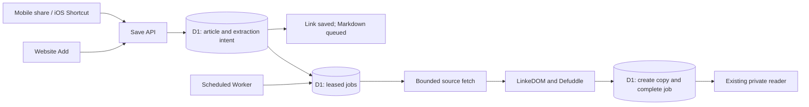

# Background Markdown extraction

Design and implementation specification, October 6, 2026. The repository now implements durable intents, leased D1 jobs, the gated processor, and website/mobile status flows. Processing defaults to paused; no production activation or deployed fetch/runtime evidence is claimed. The A01 release checks still apply. The sections below retain the proposed architecture and contracts for review.

Save the link and a durable extraction request, acknowledge the save, then fetch and convert the article on the server. An iOS Shortcut or mobile browser can close immediately after the acknowledgment. The copy becomes available in the existing reader when extraction completes.

## Current behavior and proposed change

`src/articles/handler.ts` currently fetches metadata before saving the article. Website saves with `captureMarkdown: true` additionally run Defuddle and store a copy before responding. `/api/capture` rejects that flag, so the iOS Shortcut cannot request a copy. `src/worker.ts` currently has only a fetch handler.

Reuse the pinned Defuddle 0.19.4 and LinkeDOM 0.18.13 extraction code, D1 copies, revision checks, and sanitized reader. Add durable job state and a scheduled handler. Move source fetching, metadata parsing, and Markdown conversion out of automatic-capture save requests.

| Entry point | Proposed extraction behavior |
| --- | --- |
| Website Add, including a mobile browser | Existing checked copy option requests a background copy; unchecked saves a link only |
| iOS Shortcut, `POST /api/capture` | Request a background copy by default, including existing `{url, title?}` payloads; `captureMarkdown: false` opts out |
| Installed PWA share target | Existing `/add` review submits through the website save path; extraction continues after closing it |
| Desktop bookmarklet | Reviewed browser Markdown retains priority; explicitly submit `captureMarkdown: false`, then save that draft through the existing copy endpoint |
| Import/restore | Restore supplied copies; do not automatically fetch imported URLs |

The phone must be online long enough to receive a successful link-save response. This does not add offline share delivery. PWA sharing still requires a browser with share-target support; the iOS Shortcut remains the iOS route. An acknowledgment confirms the durable request, not successful extraction.

## Architecture and scheduling

Start with **D1 jobs and a Cron Trigger in the existing Worker**. This matches the single-owner workload and the A04 plan without adding a second storage service. [Cron Triggers invoke a Worker's scheduled handler independently of a browser request](https://developers.cloudflare.com/workers/configuration/cron-triggers/).



Configure a one-minute schedule separately for staging and production. Begin with **one article per invocation**, processed sequentially. Typical scheduling delay should be around a minute with an empty backlog, but this is a target rather than a completion guarantee. One job per minute is a throughput cap, so bursts wait. Raise the batch size only after measuring the entire invocation's CPU and query use.

Use the scheduled handler as the only extraction executor initially. `waitUntil()` is unnecessary for correctness: it permits only [up to 30 seconds of work after an HTTP response or disconnect](https://developers.cloudflare.com/workers/platform/limits/#duration), and cannot replace persisted work and recovery.

[Queues currently offers a free allowance](https://developers.cloudflare.com/queues/platform/pricing/), but adds dispatch and acknowledgment coordination with D1. Consider it if immediate dispatch or higher throughput becomes necessary. Keep D1 authoritative if that happens, using an outbox and reconciliation for failed sends; Queues' free message retention is 24 hours. Workflows adds little to this single fetch-and-convert operation.

## Durable intent and jobs

Additive migration `0006_background_capture.sql` implements this storage model. Apply it through the normal environment-specific release workflow; no remote migration is performed by this implementation task.

Add nullable `articles.extraction_requested_at`. A save requesting capture records this intent in the same transaction as the article save or duplicate resolution. Store no source HTML or Markdown in the intent. After that commit, the API attempts an idempotent job upsert. The scheduler also finds recorded intents without a job or copy and materializes them. Thus a crash between saving the article and creating the job cannot lose the request; copy/job failure cannot undo a committed link.

Add `articles.title_origin`, with values `fallback`, `supplied`, `extracted`, and `protected`. Mark title edits and imports as protected; migrate existing rows conservatively as protected. This lets background metadata replace a generated title without guessing whether the owner edited it. New saves use supplied or fallback origin as appropriate.

One `article_extraction_jobs` row per article:

| Field | Purpose |
| --- | --- |
| `article_id` | Primary key, foreign key to articles with deletion cascade |
| `generation` | Increments on an explicit retry; rejects writes from an earlier run |
| `state` | `queued`, `running`, `retry_wait`, `succeeded`, or `failed` |
| `attempts` | Claims in this generation, capped at three |
| `next_attempt_at` | UTC timestamp for eligibility |
| `lease_token`, `lease_expires_at` | Random claim token and two-minute lease |
| `error_code` | Bounded, stable failure category; no raw upstream error or page text |
| `created_at`, `updated_at`, `finished_at` | Operational timestamps |

Index eligible jobs by `(state, next_attempt_at, article_id)` and running jobs by `(state, lease_expires_at)`. Index the article intent for bounded reconciliation. Keep terminal rows until article deletion, preventing the reconciler from repeatedly restarting failures. Jobs and intent are operational state and stay out of portable JSON backups.

Saving an existing normalized URL preserves its ID, read state, creation date, and copy. If it has an active job, reuse it. If it has a copy, report readiness and do no extraction. If its job has failed, show that result; repeated token shares do not reset its retry budget. An owner can explicitly retry from details.

## Claiming, retries, and completion

Claim with one conditional SQL write, incrementing attempts and setting a new lease token; return the claimed row. Do not select and then unconditionally update. A claim checks eligibility, remaining attempts, the current generation, and absence of a copy. Only the winning caller performs the source request.

1. Reconcile a bounded number of missing jobs from durable intents and recover expired leases. Reconciliation and recovery must not prevent already-due jobs from receiving a processing slot.
2. Claim one eligible job. Snapshot its generation, lease token, and article URL.
3. Fetch the source, parse metadata, and extract Markdown with the bounded pipeline below. Recheck for an existing copy before expensive work when possible.
4. Complete in a single D1 batch: conditionally insert a copy only if the article and the **unexpired current lease and generation** still exist; enrich permitted metadata; set the job succeeded and clear the lease. Every mutation is fenced by the same lease and generation.
5. If a manual or browser copy won the race, treat the job as satisfied and preserve that copy. Never replace content using a background job.

[D1 batches provide transactional rollback](https://developers.cloudflare.com/d1/worker-api/d1-database/#batch). The copy insert must include the lease predicate in SQL; calling the existing `saveArticleCopy(..., null)` alone would protect existing copies but would not fence a stale worker after a retry or cancellation.

Retry transient network failures, timeouts, HTTP 408/429/5xx, and temporary storage errors. Attempt two becomes eligible one minute after attempt one fails; attempt three after a further five minutes. For 429/503, respect a valid `Retry-After`, capped at one hour. The scheduler quantizes these times to its next tick.

Unsafe destinations, 401/403/404/410, other permanent 4xx, unsupported content, invalid encoding, oversized bodies, and conversion failures are terminal for this generation. Never save a truncated or empty copy. Show a stable explanation and offer Retry or browser/paste capture.

A lost isolate leaves a running lease. Recovery treats expiry as a consumed failed attempt, then applies backoff or exhausts the third attempt. Fence the old worker even if it resumes later. If D1 is unavailable, leave durable state for the next tick. Deleting the article cascades its job and blocks any late copy insert. Manual copy saves atomically satisfy active jobs and invalidate their leases.

Owner retries require the normal session, Origin, and CSRF checks, plus a one-minute cooldown. Reset attempts and increment generation only on a terminal failed job without a copy; an already active job returns its current state. A copy already present returns ready without fetching. Retries never refresh or overwrite an existing copy.

## API and mobile contract

Keep new-link responses at 201 and duplicate responses at 200: the article has been committed. Validation/auth/storage failures retain their existing HTTP errors. Add job information instead of waiting for `copy` or returning the synchronous `copyCaptureError`.

For owner-authenticated saves:

```json
{
  "article": { "id": "article-id", "url": "https://example.com/post", "title": "example.com/post" },
  "duplicate": false,
  "metadataUpdated": false,
  "extraction": { "state": "queued", "attempts": 0, "errorCode": null }
}
```

The abbreviated article above stands for the existing full DTO. A persisted intent without a materialized job is also queued. Owner-visible states are `none`, `queued`, `running`, `retry_wait`, `ready`, and `failed`; ready derives from copy existence rather than relying solely on job state.

| Route | Proposed contract |
| --- | --- |
| `POST /api/articles` | Keep `captureMarkdown` boolean; true requests background extraction, omitted/false keeps link-only API compatibility. Website sends true by default |
| `POST /api/capture` | Accept the same flag; omitted/true requests extraction, false saves a link only. Server code fetches and writes the copy |
| `GET /api/articles`, `GET /api/articles/:id` | Add compact `hasCopy` and `extraction` status without Markdown or per-article follow-up queries |
| `GET /api/articles/:id/extraction` | Owner-only detailed state, attempts, next retry time, and safe failure code |
| `POST /api/articles/:id/extraction/retry` | Owner-only retry; no URL or article-copy replacement fields accepted |
| Existing copy endpoints | Retain owner-only reads/writes and revision checks |

The capture token authorizes a server-generated extraction request **only as part of saving its submitted URL**. It cannot submit Markdown, select an existing article ID for mutation, read copies/status, replace a copy, retry terminal jobs, or publish to GitHub. Retain bearer authentication, cookie/Origin rejection, body limits, and capture rate limiting. Its response includes the existing save acknowledgment and a coarse `extractionRequested` boolean, without copy content, copy revision, or extraction history for a duplicate. Revoking a token blocks future saves; already accepted jobs belong to the library and continue.

The existing iOS Shortcut can keep sending `{url, title?}`. Update its confirmation to “Saved to Potem. Markdown will be captured in the background.” It ends there; it does not poll with its token. HTTP 200 means the duplicate link is already saved, not that a missing failed copy was automatically retried.

Adding a URL with automatic capture performs no source request before acknowledgment. Use a supplied title or the existing hostname/path fallback. The job later fills missing author/description and replaces only a `fallback` title, using conditional SQL against current values. A title edit during extraction wins. Automatic metadata changes may update `updated_at` but never creation/read state.

Link-only saves also skip the source request in the proposed version: new records keep the supplied/fallback title, without automatic metadata enrichment. Existing metadata stays intact. This is an intentional change from today's best-effort inline metadata request, avoiding a second fetch pipeline on mobile saves. A separate metadata-only job can be added later if this capability is needed.

## User experience

After saving, close Add and show “Link saved. Capturing Markdown in the background.” Keep the article in the inbox with a compact state: Capturing, Retrying, Saved copy, or Copy unavailable.

For an open reader/details view, poll only while its job is active, every five seconds for the first minute, then every thirty seconds. Pause in a hidden tab and stop on terminal state, navigation, or logout. Inbox status refreshes with the existing list refresh/focus behavior; avoid a continuously polling whole-library loop. These reads remain private/no-store and are never service-worker cached.

Clicking an article that is capturing opens a pending reader with Open original and Paste/upload a copy. When a copy arrives, refresh that view without discarding a dirty editor draft. Do not automatically navigate from another view or mark the article read. A failed job offers Retry, Open original, and manual/browser capture with a clear failure reason.

Keep bookmarklet draft behavior and explicit GitHub opt-in. Automatic extraction stores a private D1 copy only. This matters because the configured GitHub repository is public; a mobile share is not permission to publish there.

## Fetching and extraction boundary

Support public HTML articles. JavaScript-only pages, authenticated/paywalled content, PDFs, and blocked pages may require browser capture or manual Markdown. Do not execute scripts, load embedded resources, use the owner's cookies, or call third-party extraction fallbacks. Success means a nonempty bounded conversion was saved, not a guarantee that every paragraph behind a login or client-side renderer was obtained.

Replace the current auto-following `fetchArticlePage` behavior with one fetch module shared by source capture and any remaining metadata callers:

- HTTP(S), no embedded credentials; ports 80/443 only for automatic extraction. Keep unsupported-but-valid original links savable.
- Manual redirects, at most three hops; resolve relative Location headers and revalidate each destination. Reject HTTPS-to-HTTP downgrades and loops. Fetch the article's persisted original URL; redirects/canonical tags do not change deduplication identity.
- Reject literal and resolved loopback, private, link-local, multicast, reserved, and metadata-service destinations, including IPv6 and mapped IPv4 forms. Block Potem's own API/origin. Verify all destination candidates and CNAME resolution.
- DNS checks must match the address actually connected to. A DNS-over-HTTPS preflight followed by an ordinary hostname `fetch()` can resolve twice and is not sufficient rebinding protection. Prove the chosen deployed egress policy enforces public destinations at connection time, or use a controlled fetching gateway that resolves, validates, and connects to the validated address while checking the original hostname's TLS certificate. Gateway eligibility/cost and privacy must be reviewed before selecting it.
- Five-second timeout per hop and a twenty-second overall network deadline. Cancel bodies on redirects, rejection, or timeout; do not forward user/token/session headers, cookies, or sensitive referers.
- Require a successful complete HTML/XHTML response and supported text encoding. Stream at most 512 KiB of decoded response bytes; count actual delivered bytes rather than trusting Content-Length. Reject overflow/incomplete/invalid text. Retain the final validated URL for resolving relative Markdown links.
- Run the existing inert extractor with `useAsync: false`. Require nonempty Markdown of at most 256 KiB UTF-8. Use a fresh DOM per job and release it after completion. Record bounded error codes, not thrown page content.

The DNS/connection requirement is unresolved in the current code. Ordinary Workers hostname fetch is not a proven address-pinning mechanism; Cloudflare documents [limitations on direct-IP fetches](https://developers.cloudflare.com/workers/platform/known-issues/#fetch-to-ip-addresses). Enable arbitrary-source extraction only after the deployed fetch boundary passes A01. An allowlist pilot can test trusted origins, but cannot be described as arbitrary mobile-link support.

## Copies, backups, and operating limits

Keep the current copy schema and version-2 backup format: server captures use the existing `source: "paste"` compatibility value. Show the current “captured or pasted Markdown” label. Job status records the extraction operation; adding a distinct exported source value would require coordinated import, conversion, GitHub, and database changes and is deferred.

Existing copy exports/restores continue unchanged. Jobs, leases, and token references are not exported. Restoring a link without a copy does not initiate network access. Backfilling old links is a separate owner action with bounded scheduling; this proposal affects new saves and explicit retries.

At one tick per minute, scheduling makes 1,440 invocations per day even when idle. The implemented enabled processor performs three bounded SQL statements per tick (recovery, materialization, and claim), approximately 4,320 statement executions daily before job completion and polling. The disabled processor performs no database work. An indexed eligibility preflight is a possible later optimization; measure row usage rather than assuming statement count equals billed rows. Budget busy-job claims, state writes, reconciliation, and UI polling against current account usage. Keep job processing configurable and pausable without blocking URL saves; show “Capture paused” for pending work while disabled.

The documented [Workers Free CPU budget is 10 ms per scheduled invocation](https://developers.cloudflare.com/workers/platform/limits/#cpu-time). Network wait does not count as CPU, but DOM parsing, conversion, and serialization do. Moving Defuddle to a scheduled handler does not prove it fits this budget. Benchmark representative and worst-case accepted inputs in deployed staging, including cold/warm runs and pathological DOM shapes. If it cannot fit with margin, record that result and choose a paid runtime or a separate executor explicitly; do not silently upgrade the account or claim free operation. Keep one-job invocations until evidence supports a larger batch.

Log aggregate counts, job identifiers, safe error codes, age, attempts, CPU, and output bytes. Never log private URLs, HTML, Markdown, cookies, or credentials. Track the oldest pending intent/job and scheduled failures so a dead scheduler cannot leave an unexplained permanent Capturing state. Define an operational pause when repeated resource exhaustion occurs instead of endlessly consuming new attempts across the backlog.

## Delivery and acceptance

1. **A01 spike:** prove connection-time destination enforcement, redirect handling, and deployed extraction CPU/memory limits. Document supported inputs and costs before enabling background capture.
2. **Persistence:** additive intent/title-origin/job migration; transactional save intent, idempotent scheduling, conditional claims, lease recovery, generation fencing, terminal error mapping, and atomic completion. Keep extraction disabled by configuration initially.
3. **API and processor:** scheduled handler, shared bounded fetch, mobile capture default, owner status/retry endpoints, metadata enrichment, and create-only copy completion. Update response types and the tests that currently require token extraction rejection.
4. **UI and guides:** asynchronous Add/pending reader, compact list states, polling, manual retry, bookmarklet opt-out, Shortcut confirmations, and documentation. Remove assumptions that capture returns an immediate copy.
5. **Staging and release:** isolated jobs/copies, measured scheduler and storage use, actual iOS Shortcut and supported Android PWA checks, then production activation using compatible migrations and a pause switch.

Required automated checks exercise save response before source work; mobile token intent and read/replace restrictions; disconnect after acknowledgment; crash before job materialization; concurrent saves/claims; lease expiry after each attempt; old-generation completion; transient backoff and Retry-After; exhausted/permanent failures; D1 completion rollback; duplicate failed jobs; deletion and manual-copy races; edited titles/read-state preservation; unsafe redirect/DNS/rebinding fixtures; complete byte/encoding bounds; and export/import compatibility. Browser smoke covers pending/ready/failed views, draft preservation, manual-copy priority, narrow layouts, and zero unsolicited GitHub writes.

Run the existing TypeScript, Worker/D1, browser-smoke, backup/recovery, and build checks when implementing. Local fixtures cannot establish deployed DNS protection, plan headroom, or actual-device share support. Automated implementation evidence is recorded in the implementation tracker; it does not establish deployed DNS protection, plan headroom, or actual-device share support.
