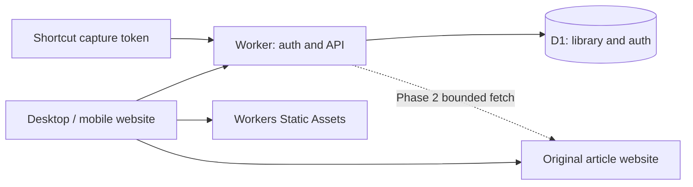

# Read Later: service design

Status: proposed implementation. Updated September 30, 2026. This document is the contract for the tasks in [tasks.md](tasks.md); it does not describe features already shipped.

## Product decision

Build a private, single-owner article inbox with a responsive website. Save URLs quickly, keep an unread queue, open the original page, and explicitly mark an item read. Assume one owner across multiple devices; do not build public registration or collaboration. Use TypeScript on Cloudflare Workers with Workers Static Assets and one D1 database (SQLite semantics). Use plain HTML/CSS and TypeScript for the client; avoid a large frontend framework and ORM initially.

The database should be ordinary tables, SQL migrations, and prepared statements. D1 removes the need to operate a database server on Cloudflare. A JSON file cannot safely handle concurrent saves and is not durable storage inside a Worker. GitHub commits are useful for the old vault reader, but add latency and conflict handling to routine read-state changes. A conventional Node server with SQLite remains a viable alternative if Cloudflare becomes unsuitable, but is not a second deployment target for the MVP.

## Release scope

MVP includes owner login, save URL with optional title, duplicate detection, unread/read/all lists, title and URL search, stable pagination, original-page links, read/unread toggles, deletion, and JSON export/import. Desktop capture uses an Add form and a bookmarklet. Mobile capture uses the same form, an iOS Shortcut, and a PWA share target on supported devices. Saving does not fetch the source page: use supplied title or hostname plus path as the display label.

Phase 2 adds best-effort Markdown preservation and an in-site reader for saved copies. Tags, recommendations, email ingestion, native apps, collaborative accounts, automatic read tracking, full-text archive search, image mirroring, and browser rendering infrastructure are deferred. Links to PDFs or other HTTP documents are accepted in the MVP, but HTML extraction in phase 2 does not imply PDF conversion.

## User experience and capture

The home screen opens to Unread, newest first. Show title, source hostname, saved date, Open original, and Mark read. Read and All are separate filters. Keep the Add field easy to reach on mobile; support keyboard navigation, visible focus, useful empty/loading/error states, and accessible status messages. An item detail view exposes its URL, title edit, and delete confirmation. Opening the original uses a normal link with `target="_blank"` and `rel="noopener noreferrer"`. It never marks the item read automatically; the service cannot know whether the external article was finished. Persist read changes on the server, and display a failed mutation without pretending it succeeded.

| Entry point | Flow | Authentication |
| --- | --- | --- |
| Website, all devices | Paste URL, optionally enter title, Save | Owner session |
| Desktop bookmarklet | Open `/add?url=…&title=…` with encoded page URL/title; confirm Save | Owner session; log in if needed |
| iOS Shortcut | Share a URL to a Shortcut that POSTs JSON to the capture API and reports success/duplicate/failure | Revocable capture token in Shortcut settings |
| Installed PWA | Share target opens `/add` with title/text/url fields; confirm Save | Owner session |

The GET `/add` route only prefills a form and never writes data. If login is needed, preserve the draft in sessionStorage on this origin before redirecting to OAuth; return to a fixed same-origin `/add` route. Never pass an arbitrary external return URL through login. Parse a shared URL field first, then a single HTTP(S) URL in shared text. If ambiguous, ask the user to select or paste a URL. Do not silently save an unrelated link.

An installed PWA share target is an enhancement, not universal mobile support. MDN labels the manifest feature as limited availability. iOS therefore has an explicit Shortcut path and a paste fallback. Bookmarklets can be blocked by some pages or browser policies; the Add form is always available. Include installable manifest/icons and a minimal service worker, but promise no offline writes or offline library in the MVP. Cache only versioned app assets; never authenticated API responses, OAuth routes, or article data. A manifest alone is not a complete install/offline experience. See [MDN share targets](https://developer.mozilla.org/en-US/docs/Web/Progressive_web_apps/Manifest/Reference/share_target).

## Architecture



Use one deployment and same-origin APIs, without CORS in the MVP. Route `/api/*` and `/auth/*` through the Worker before assets; serve the public app shell via assets. The shell contains no private data. Authentication guards every library request. Keep domain validation and storage access separate from HTTP handlers, but avoid a generic multi-provider storage abstraction. D1 queries live in a small repository module; local development uses Wrangler's local D1 with the same migrations. The old `server.mjs` cannot be deployed unchanged as a Worker: it uses a listening HTTP server, filesystem storage, and process-local sessions.

Suggested implementation layout:

```text
src/worker.ts          routing and response policies
src/auth/             OAuth, sessions, capture tokens
src/articles/         validation, normalization, SQL repository
src/contracts.ts      shared request/response types
web/                  new website and capture UI
migrations/           ordered D1 SQL migrations
tests/                meaningful contract/integration tests
wrangler.jsonc        Worker, assets, D1 bindings; no secrets
```

## Authentication and privacy

Reuse the prototype's GitHub login concept, not its in-memory session implementation. Configure exactly one allowed immutable GitHub numeric user ID. Require OAuth client credentials, allowed ID, and a fixed HTTPS application origin in deployed environments; fail closed if missing. OAuth uses a short-lived, one-time state record bound to the initiating browser through a secure cookie. Request only the identity scope needed; no repository write token is required. Validate callback state and identity before issuing a random session token. Persist only session-token hashes in D1 with expiry; use an HttpOnly, Secure, SameSite=Lax cookie. Logout deletes the session. Clean expired auth records periodically or opportunistically with bounded work. Local development may use an explicit loopback-only auth bypass, never enabled by deployment configuration.

Cookie-authenticated writes require exact same-origin Origin validation and a session-bound CSRF token; OAuth callback has its own state validation. Apply private/no-store to library and auth responses, a restrictive CSP to the app, and escape all displayed titles and URLs. Never put session/capture tokens in query strings or bookmarklets. Share URLs can appear in browser history, so strip the Add query using history replacement after storing its draft. Do not log request bodies, article URLs, token values, or OAuth codes.

The owner creates a capture token in Settings after login. Reveal the random token once; store only a cryptographic hash, label, creation time, and revocation time. The bearer token can only call `POST /api/capture`: it cannot list, read, modify, export, or delete the library. Token-authenticated calls have no cookie dependency and no CORS allowance. Provide revocation and rotation for a lost device. Bound body size (16 KiB), URL length (8 KiB), title length (500 characters), and capture usage (initially 60 requests/minute/token). The implementation must use a durable atomic limiter or a documented platform rate limiter rather than a process-local counter; account for limiter availability in the deployment chunk.

## Data model

One library needs no users table. Use UTC ISO timestamps generated on the server and random UUID article IDs.

```sql
CREATE TABLE articles (
  id TEXT PRIMARY KEY,
  url TEXT NOT NULL,
  normalized_url TEXT NOT NULL UNIQUE,
  title TEXT NOT NULL,
  created_at TEXT NOT NULL,
  updated_at TEXT NOT NULL,
  read_at TEXT
);
CREATE INDEX articles_created ON articles(created_at DESC, id DESC);
CREATE INDEX articles_read_created ON articles(read_at, created_at DESC, id DESC);
```

`read_at IS NULL` means unread. A duplicate save returns the existing item, leaves its read state and creation time intact, and does not overwrite an edited title. The unique constraint resolves concurrent duplicate saves; catch that conflict and return the existing row. Explicitly marking read twice retains the first read timestamp. Marking unread clears it. Each effective mutation updates `updated_at`. Concurrent read-state edits use last committed write wins, acceptable for one owner; the client consumes the returned server state.

Also create `sessions(token_hash, csrf_token, expires_at, created_at)`, `oauth_states(state_hash, browser_binding_hash, expires_at)`, and `capture_tokens(id, token_hash UNIQUE, label, created_at, revoked_at)`. Index expiry columns and bound cleanup. Add a rate-limit storage table only if the chosen limiter needs one. Do not invent generic profile/settings tables without a feature that uses them.

Normalize with the URL parser: allow only HTTP(S), reject credentials, lowercase hostname, remove default ports and fragments, and strip a small explicit list of tracking keys (`utm_*`, `fbclid`, `gclid`). Preserve all other query parameters, their order, path case, and trailing slash. Keep the submitted URL as `url`; use the normalized version solely for deduplication. Do not follow redirects or trust publisher canonical tags for deduplication. Some fragments and tracking-looking parameters affect content; document this tradeoff and allow revisiting the normalization policy through an explicit migration, never silently recomputing identities on deploy.

## HTTP contract

JSON uses camelCase. Article DTO: `{id, url, title, createdAt, updatedAt, readAt}`. Errors: `{error: {code, message}}`, with no stack or secret data. Validate unknown fields and types. IDs are opaque; SQL always uses bound parameters.

| Method and route | Contract |
| --- | --- |
| `GET /api/session` | Session state and CSRF token for signed-in client; no library data for anonymous callers |
| `GET /auth/github`, `GET /auth/github/callback` | OAuth start and callback |
| `POST /auth/logout` | Revoke session; CSRF protected |
| `POST /api/articles` | `{url, title?}`; 201 `{article, duplicate:false}` or 200 `{article, duplicate:true}` |
| `POST /api/capture` | Same save contract, capture bearer token only |
| `GET /api/articles?status=unread&q=…&limit=50&cursor=…` | `{items, nextCursor}`; status unread/read/all, limit 1–100 |
| `GET /api/articles/:id` | `{article}` or 404 |
| `PATCH /api/articles/:id` | `{read?:boolean, title?:string}`; at least one field; return `{article}` |
| `DELETE /api/articles/:id` | 204 if deleted or already absent |
| `GET /api/export` | Versioned JSON download including all records; bounded/paged processing |
| `POST /api/import` | Versioned JSON, maximum 1 MiB and 1,000 items; atomic validated import; returns counts |
| `POST /api/capture-tokens` | `{label}`; returns ID and one-time token |
| `GET /api/capture-tokens` | IDs, labels and dates only |
| `DELETE /api/capture-tokens/:id` | Revoke token |
| `GET /healthz` | Public `{ok:true}`; no binding/configuration/identity disclosure |

Only session and health/OAuth entry points have anonymous access. Distinguish 400 validation, 401 authentication, 403 authorization/CSRF, 404 missing item, 413 body limit, 429 rate limit, and 503 storage unavailability. Never report Saved after a failed D1 write.

Keyset cursor encodes the last `(createdAt,id)` and is validated; order descending and use the same filters each page. Search is case-insensitive title/URL substring search, bound and with LIKE wildcards escaped. MVP search may scan this small personal library; defer FTS until measurements warrant it. Refresh after mutations and clear stale cursors on filter changes. Avoid downloading the full library for every page.

Export format is `{version:1, exportedAt, articles:[…]}` and excludes auth tables. Import validates the entire batch before writing, preserves IDs/dates for new items, skips existing normalized URLs without changing read state, and rejects an ID colliding with a different URL. Use D1 transactional batches and limit SQL statement sizes; tests must cover atomic failure and repeat import. Export large libraries in bounded pages; document snapshot consistency limits if edits happen during export. Download exports regularly; provider recovery is additional protection, not the only backup.

## Markdown preservation: phase 2

Start with owner-submitted Markdown uploads/paste, including files produced by Obsidian Web Clipper, then evaluate server-side extraction. Browser-clipped content handles logged-in and JavaScript pages better than an unauthenticated fetch. Never send browser cookies to the service or bypass paywalls. Store Markdown in a separate `article_copies` table keyed by article ID, with content, captured time, source URL, extractor version and status/error metadata. Keep read state in `articles`. Default to a maximum 256 KiB UTF-8 Markdown copy; avoid returning copies in list queries. D1 keeps the first archive iteration to one database; move large text/assets to R2 only after a measured need and a separate cost review.

For automatic capture, persist a bounded D1 job with pending/running/succeeded/failed state, attempt count, next retry time, and lease expiry. A scheduled Worker processes a small batch, uses conditional lease updates, and retries temporary failures with capped backoff (three attempts); exhausted jobs expose an error and manual retry. Save the URL first, regardless of archive success. Crashed jobs become claimable when their leases expire. Write the copy and finish the job atomically. Do not rely on `waitUntil` as a durable queue.

Evaluate Mozilla Readability plus an HTML-to-Markdown converter against the actual Worker runtime and free CPU limit before selecting packages. Source references: [Readability](https://github.com/mozilla/readability) and [Turndown](https://github.com/mixmark-io/turndown). HTML DOM dependencies and extraction cost may require a different runner; prototype before promising automatic extraction on the free tier. No headless browser is planned. Dynamic, blocked, paywalled, PDF, or failed pages remain usable as original links, with a visible archive status.

Remote fetching introduces SSRF: allow public HTTP(S) only, reject local/private/link-local/multicast/reserved addresses and hostnames, disable automatic redirects, and revalidate every redirect. A lexical hostname check alone is insufficient because public names can resolve to private addresses. Establish a tested DNS/egress enforcement mechanism for the runtime, including rebinding, before enabling automatic fetch. If this cannot be enforced, ship browser-provided Markdown only. Bound elapsed time, redirects (three), streamed response bytes (2 MiB), content type, and extraction output. Render Markdown using a maintained parser plus sanitizer, disable raw HTML, and block unsafe link protocols. Images are omitted or external references initially; an archive with external images is a text backup, not a complete offline replica. Keep archives private and include Markdown download with source and capture metadata.

## Free deployment proposal

As checked September 30, 2026, Workers Free allows 100,000 dynamic requests/day and 10 ms CPU/request; static asset requests are free and unlimited. D1 Free includes 5 million rows read/day, 100,000 rows written/day and 5 GB total storage. A single free D1 database has a separate 500 MB limit. These are account quotas, not allocations reserved for this app. Index maintenance also consumes writes. A modest single-owner URL inbox should fit comfortably; this is an estimate, not a free-hosting guarantee. See [Worker limits](https://developers.cloudflare.com/workers/platform/limits/), [asset billing](https://developers.cloudflare.com/workers/static-assets/billing-and-limitations/), [D1 pricing](https://developers.cloudflare.com/d1/platform/pricing/), and [D1 limits](https://developers.cloudflare.com/d1/platform/limits/).

Deploy on a free `workers.dev` hostname to avoid buying a domain. Create D1, apply migrations, bind it as `DB`, build assets, configure asset routing, and store OAuth credentials via Wrangler secrets. Register the exact deployed OAuth callback and configure the allowed owner ID and origin. Keep local, staging and production databases separate. Pin tooling versions when implementing and document local dev/build/test/deploy scripts. Use Free explicitly and do not enable paid services automatically. Recheck quotas and rate-limiter availability before deployment. At free limits, requests or database operations fail; provide a retryable error and preserve drafts. Archive extraction needs a separate CPU feasibility gate.

Release requires desktop and mobile save/read smoke tests on the deployed origin, a private-data access check, export/import round trip, quota/error handling, and a documented restore procedure. Inspect metrics without logging article contents. Roll back Worker code only to a migration-compatible version; back up before destructive schema changes. Do not remove the prototype or migrate the Obsidian vault automatically.

## Existing repository and migration

The preserved prototype already provides responsive list/reader styling, themes, original links, local Markdown parsing, GitHub storage and OAuth. Reuse visual ideas and fixtures selectively. Replace filesystem/GitHub storage, read-frontmatter writes, and process-local auth for the new service. Current Docker instructions remain in [prototype.md](prototype.md).

An optional one-time vault importer should read source/title/read/readAt/added metadata without modifying originals, produce the versioned JSON format, and report missing or invalid URLs. Files without source URLs should be reported for manual review rather than discarded; phase 2 may import their Markdown. Reconcile counts and export the new library before retiring any old workflow.
